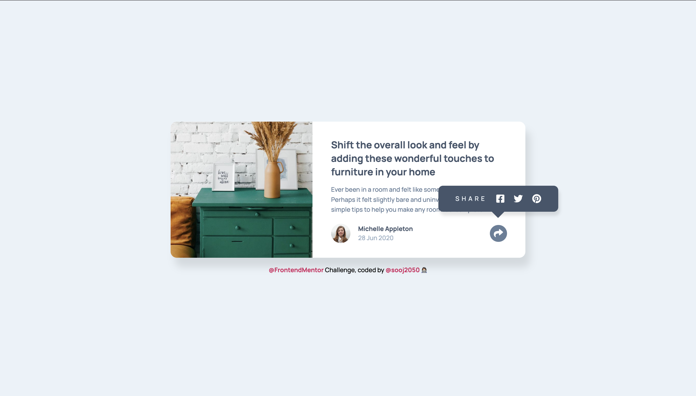

# Frontend Mentor - Article preview component solution

## Table of contents

- [Overview](#overview)
  - [The challenge](#the-challenge)
  - [Screenshot](#screenshot)
  - [Links](#links)
- [My process](#my-process)
  - [Built with](#built-with)
  - [What I learned](#what-i-learned)
  - [Useful resources](#useful-resources)
- [Author](#author)

## Overview

### The challenge

Users should be able to:

- View the optimal layout for the component depending on their device's screen size
- See the social media share links when they click the share icon

### Screenshot



### Links

- Solution URL: [Add solution URL here](https://your-solution-url.com)
- Live Site URL: [Add live site URL here](https://your-live-site-url.com)

## My process

### Built with

- Semantic HTML5 markup
- CSS custom properties
- Flexbox
- CSS Grid
- Desktop-first workflow

### What I learned

- Making a speech bubble shape with CSS.
- Using the blur event to remove focus on the button when "ESC" key is pressed.
- Learning how to activate an event when outside is clicked.

```css
.share-popup::before {
  content: "";

  position: absolute;
  top: 76%;
  right: 45%;
  transform: translateX((-50%));

  border-top: 0.8rem solid var(--very-dark-grayish-blue);
  border-right: 0.8rem solid transparent;
  border-left: 0.8rem solid transparent;

  margin: 0.8rem 0 0 -1.5rem;
}
```

```js
document.addEventListener(`keydown`, function (e) {
  if (e.key === `Escape` && !speechBubble.classList.contains(`hidden`)) {
    speechBubble.classList.add(`hidden`);
    btnShare.blur();
  }
});

document.addEventListener(`click`, function (e) {
  if (!btnShare.contains(e.target) && !speechBubble.contains(e.target)) {
    speechBubble.classList.add(`hidden`);
  }
});
```

### Useful resources

- [Example resource 1](<https://bobbyhadz.com/blog/javascript-remove-focus-from-element#:~:text=Use%20the%20blur()%20method,on%20the%20activeElement%20property%20%2D%20document.>) - How to remove focus from an element using blur event.

## Author

- Frontend Mentor - [@kongguksu](https://www.frontendmentor.io/profile/kongguksu)
- Twitter - [@sooj2050](https://www.twitter.com/sooj2050)
